# 🎟️ mticket - Ứng dụng quản lý bán vé điện tử

**mticket** là một ứng dụng desktop được phát triển bằng Java Swing, giúp quản lý việc bán vé, người dùng và thống kê doanh thu. Ứng dụng phù hợp triển khai cho các rạp chiếu phim, nhà hát hoặc hệ thống tổ chức sự kiện nhỏ.

## 📸 Giao diện người dùng

### Xác thực người dùng:

- #### GIAO DIỆN CHỨC NĂNG ĐĂNG NHẬP:
  > > 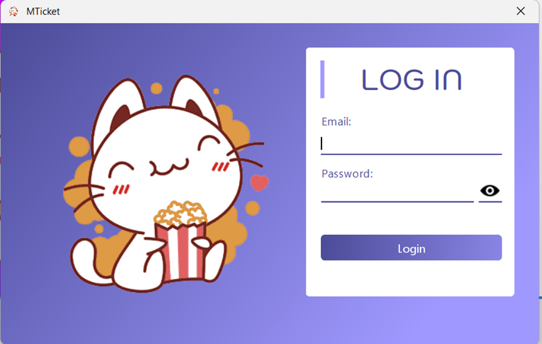

### Nhân viên bán vé:

- #### GIAO DIỆN CHỨC NĂNG CHỌN PHIM:
  > > 
- #### GIAO DIỆN CHỨC NĂNG CHI TIẾT PHIM:
  > > 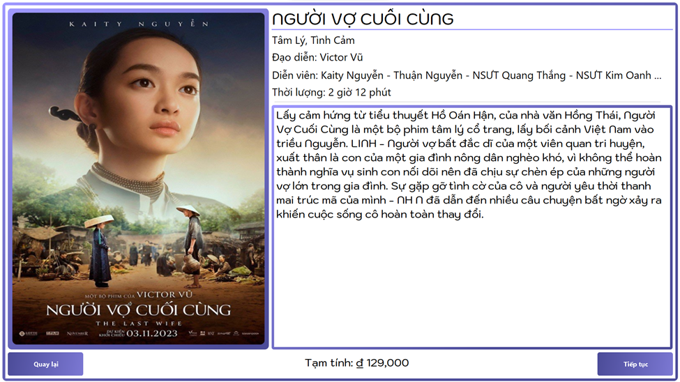
- #### GIAO DIỆN CHỨC NĂNG CHỌN CHỖ NGỒI:
  > > 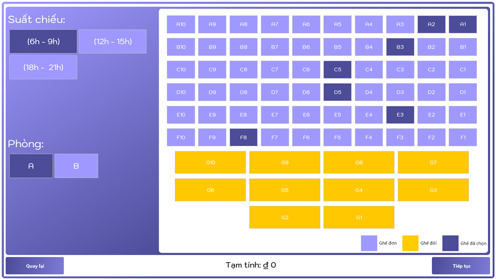
- #### GIAO DIỆN CHỨC NĂNG QUẢN THỨC ĂN:
  > > 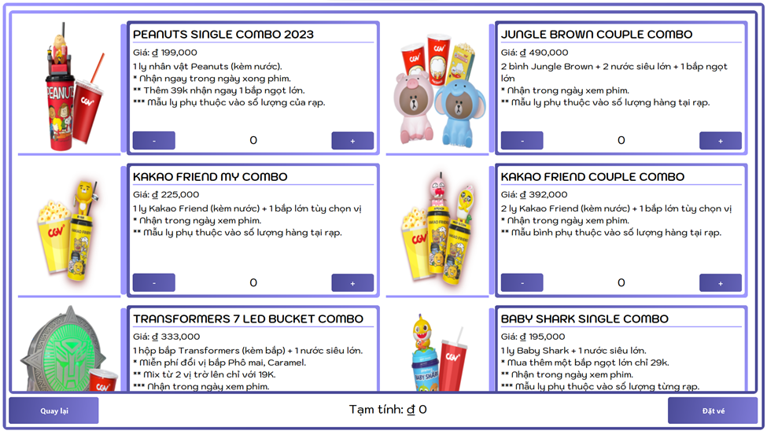
- #### GIAO DIỆN CHỨC NĂNG CHỌN PHƯƠNG THỨC THANH TOÁN:
  > > 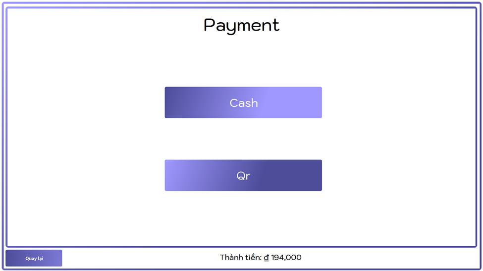
- #### GIAO DIỆN CHỨC NĂNG CHỌN THANH TOÁN QR:
  > > 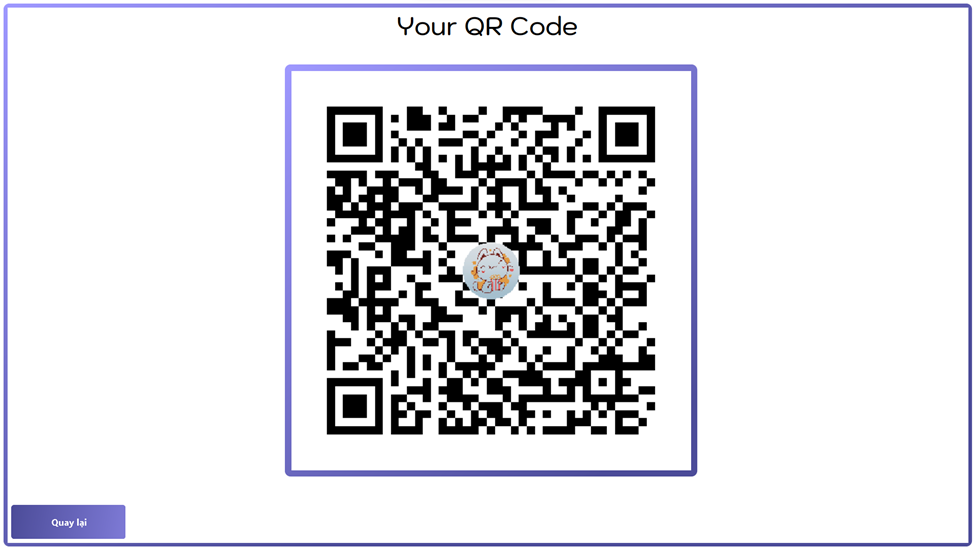

### Quản Trị Viên:

- #### GIAO DIỆN CHỨC NĂNG QUẢN LÝ PHIM:
  > > 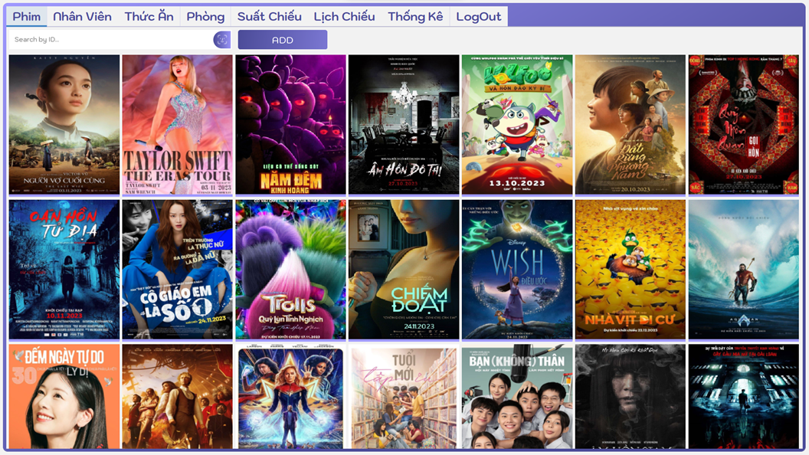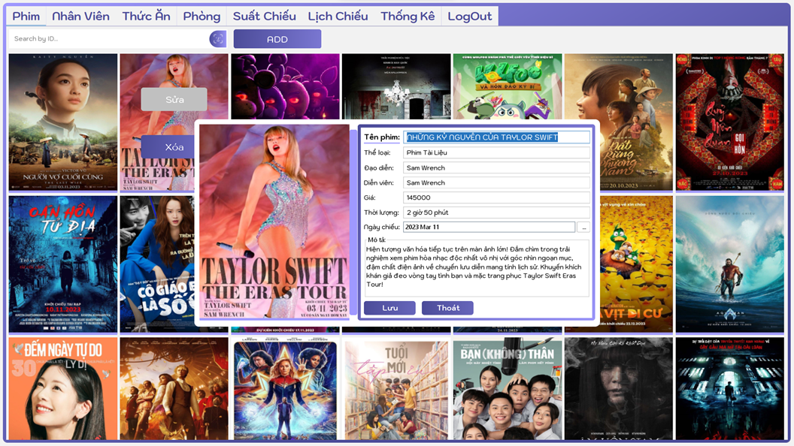
- #### GIAO DIỆN CHỨC NĂNG QUẢN LÝ NHÂN VIÊN:
  > > 
- #### GIAO DIỆN CHỨC NĂNG QUẢN LÝ THỨC ĂN:
  > > 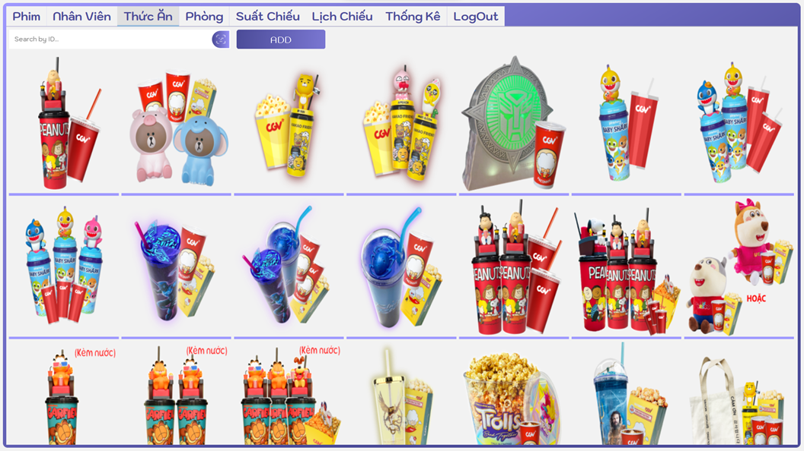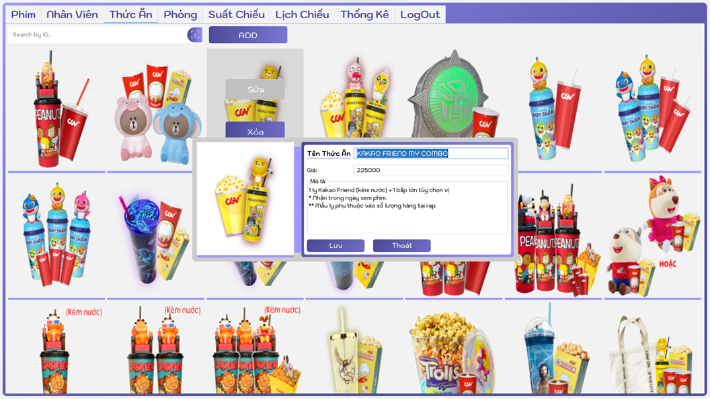
- #### GIAO DIỆN CHỨC NĂNG QUẢN LÝ PHÒNG:
  > > 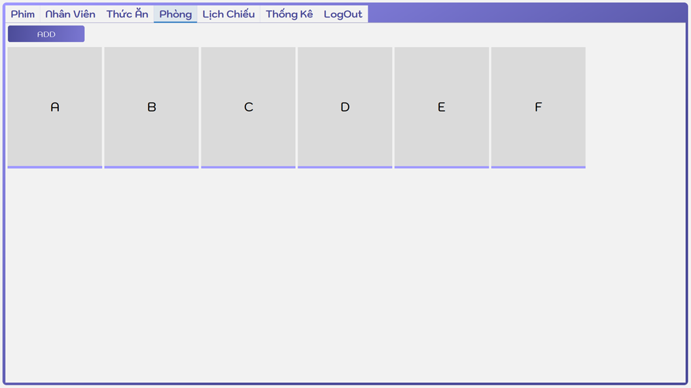
- #### GIAO DIỆN CHỨC NĂNG QUẢN LÝ SUẤT CHIẾU:
  > > 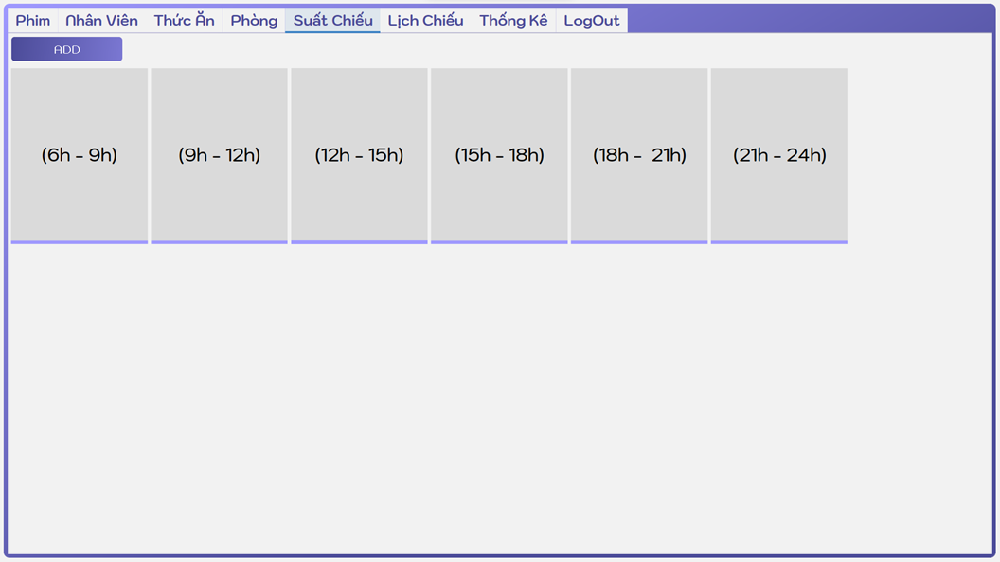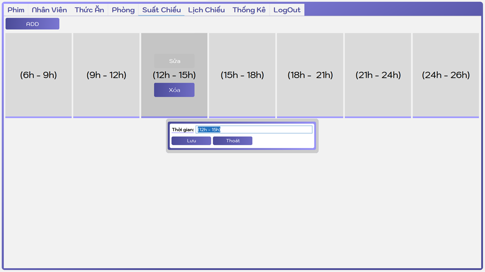
- #### GIAO DIỆN CHỨC NĂNG QUẢN LÝ LỊCH CHIẾU:
  > > 
- #### GIAO DIỆN CHỨC NĂNG QUẢN LÝ THÔNG KÊ:
  > > 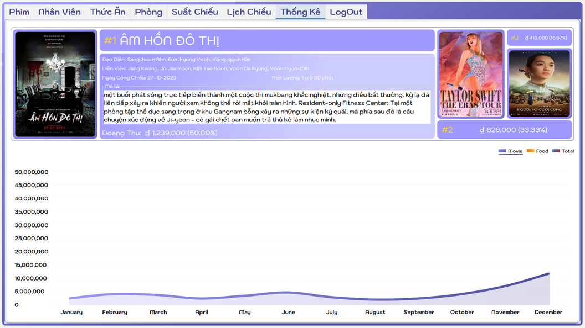

## 🚀 Tính năng chính

- 📦 Quản lý vé: tạo, sửa, xóa, tìm kiếm vé.
- 👥 Quản lý người dùng: đăng nhập, phân quyền, quản trị.
- 📊 Thống kê: báo cáo doanh thu, số lượng vé bán theo thời gian.
- 🔐 Phân quyền truy cập: người dùng thông thường và quản trị viên.
- 💾 Lưu trữ dữ liệu bằng MySQL.

## 🏗️ Công nghệ sử dụng

- Java 8+
- Java Swing (GUI)
- JDBC (kết nối cơ sở dữ liệu)
- MySQL
- NetBeans IDE (khuyến nghị sử dụng để build/run)

## 🛠️ Hướng dẫn cài đặt

### 1. Yêu cầu hệ thống

- Java JDK 8 trở lên
- MySQL Server
- NetBeans IDE hoặc bất kỳ IDE nào hỗ trợ Java Swing

### 2. Clone dự án

```bash
git clone https://github.com/HuyTinh/mticket.git
```

### 3. Cài đặt cơ sở dữ liệu

- Mở file `mticket_Database.sql` và chạy trên MySQL để tạo cơ sở dữ liệu và bảng.

### 4. Chạy ứng dụng

- Mở dự án trong NetBeans
- Click chuột phải vào project > Run

## 🧑‍💻 Đóng góp

Mọi đóng góp đều được hoan nghênh! Vui lòng tạo issue hoặc pull request nếu bạn muốn cải tiến dự án.

## 📄 License

Dự án hiện chưa có giấy phép. Bạn có thể sử dụng nội bộ hoặc theo thỏa thuận cá nhân.

## 📬 Liên hệ

Tác giả: [HuyTinh](https://github.com/HuyTinh)
